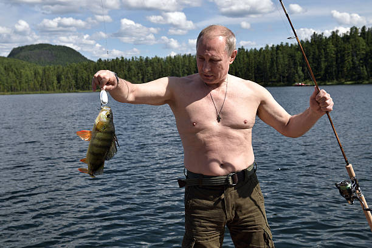
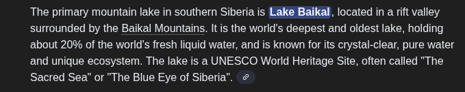
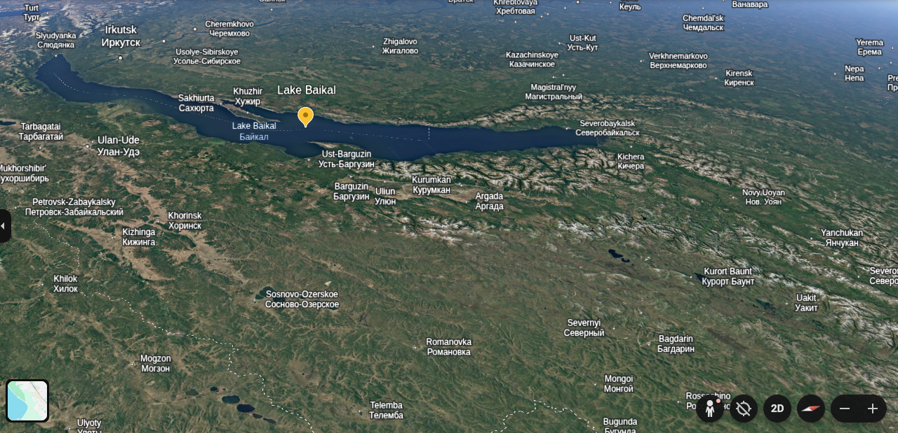

## Geolocation projects

- Into this one we will take a look into geolocation osint projects which identifying where and where the photo media was taken, based on the below image.

  

**Step 1**: Where

- Into this step we will upload the image into google images search and try to see related informations about the image, news related to the images and people related to the image.

- so upload into google images searches and see information related to the image.

then find blogs, new sites which are russia based to see what are the news about.

- and by looking at one of the news from we got this one [https://wjla.com/news/nation-world/russias-putin-shows-off-spoils-from-siberia-fishing-trip](https://wjla.com/news/nation-world/russias-putin-shows-off-spoils-from-siberia-fishing-trip) and based on an article shows the following

> MOSCOW (AP) — Russian President Vladimir Putin has gone spearfishing in southern Siberia's mountains, the latest outdoor exploit for the action man and adventure-loving Russian leader on mountain lake.

- so the location is southern Siberia's mountains.

**Step 2** Searching the location using [google earth](https://earth.google.com/)

- by using google location I will use the following search term `southern Siberia's mountains lake`

and remember sometimes it is called lake baikal.

from google earth search results I got

- also coming back to the image where putin took it shows at the back there is a mountain.
  

> 53°33'31"N 108°09'53"E and it is found at Southeast.
